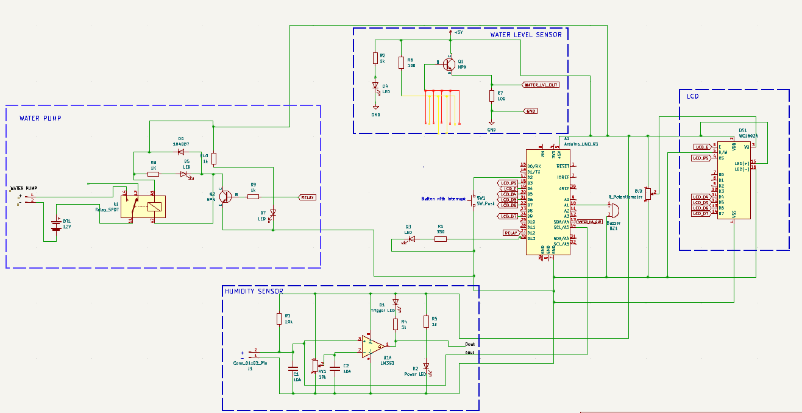
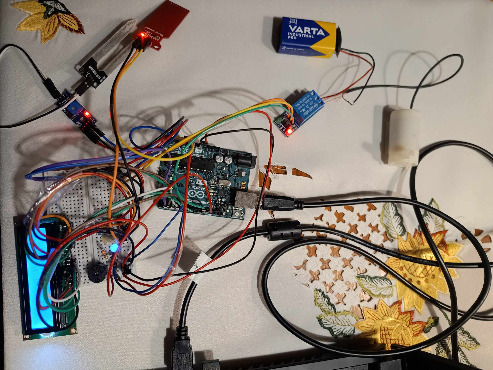
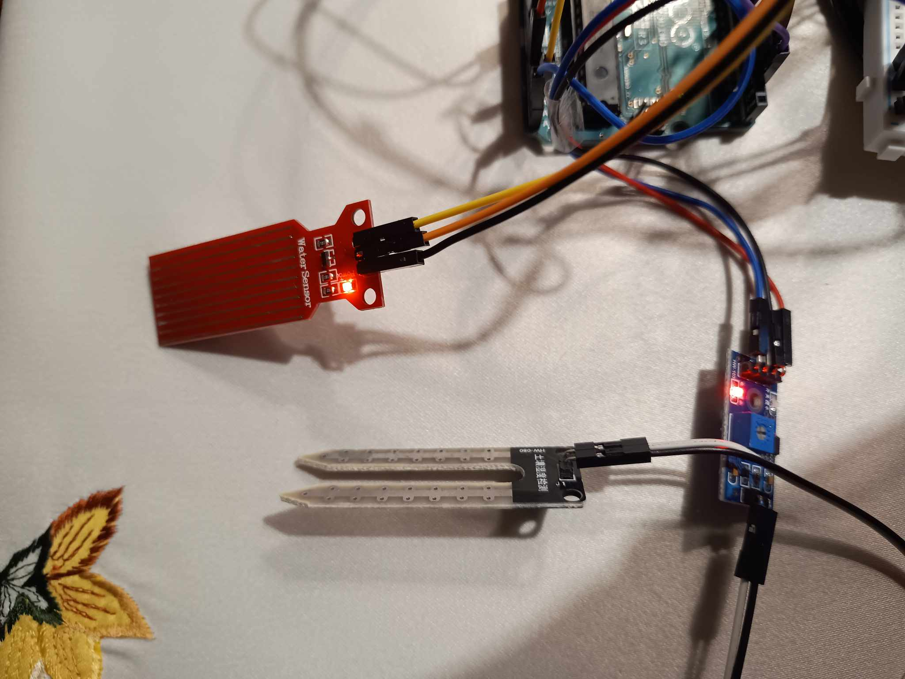
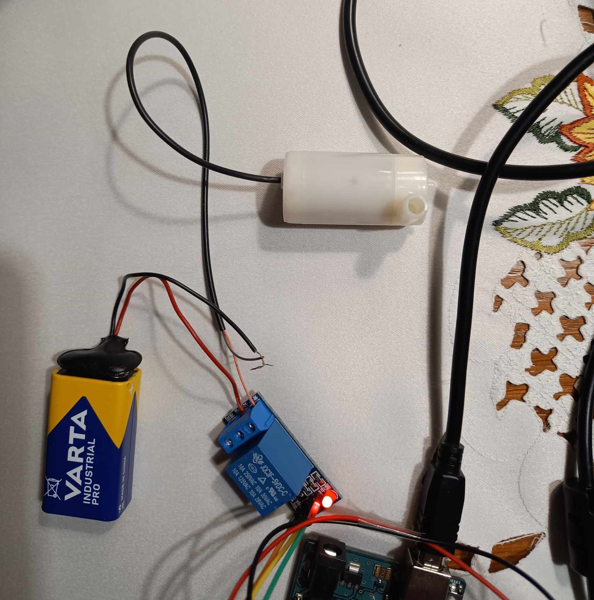

# System Podlewania Roślin

**Opis projektu** \
Na podstawie danych z czujnika wilgotności, który jest umieszczony w glebie, mikrokontroler analizuje odczyt i na jego podstawie decyduję o uruchomieniu systemu podlewania. Gdy roślina musi zostać podlana, mikrokontroler wysyła sygnał do przekaźnika, który uruchamia pompkę wodną. Przez rurkę woda jest doprowadzana do gleby. System wyłącza pompkę, gdy odczyt z czujnika wilgotności będzie powyżej poziomu minimalnego. Projekt w celu lepszego dopasowania do potrzeb rośliny posiada 3 różne poziomy wilgotności (Wysoki, średni, niski), które są ustawiane za pomocą przycisku. Informacje o wybranym trybie i o aktualnej wilgotności gleby wyświetlane są na wyświetlaczu LCD. Przy pomocy terminala możemy skalibrować czujniki. System posiada również system alarmowy, który załącza się w wypadku wykrycia awarii. 

**Funkcjonalności**\
    * Wykrywanie zbyt niskiej wilgotności gleby\
    * Ustawienie 3 poziomów progu wilgotności\
    * Informacje o obecnej wilgotności oraz wybranym poziomie \
    * Automatyczne podlewanie\
    * Powiadomienie o zbyt niskim poziomie wody w zbiorniku\
    * Alarm w przypadku awarii\
    * Konfiguracja czujników\

  **Komponenty**\
    * Arduino UNO\
    * Wyświetlacz LCD 2x16 znaków - green - justPi\
    * Przycisk\
    * Potencjometr\
    * Przekaźnik 5V 10A AVR ARM\
    * Bateria 9V\
    * Pompka wodna 3-12V\
    * Czujnik wilgotności FC-28\
    * Płytka stykowa\
    * Rurka silikonowa\
    * Klip na baterie\
    * Przewody połączeniowe\
    * Buzzer\
    * Dioda LED\
    * Czujnik poziomu wody\
    * Kabel do podłączenia Arduino do komputera\
    **Schemat**\
    

**Szczegółowy opis działania elementów systemu**

**Czujnik wilgotności**\
Czujnik  FC-28 co dwie sekundy sprawdza poziom wilgotności w doniczce i wysyła dane do Arduino. Mikrokontroler odbiera dane i mapuje je w celu otrzymania wartości procentowej. Gdy wartości jest zbyt mała, system włącza pompkę i doprowadza wodę do doniczki,  dopóki czujnik nie odczyta wartości powyżej ustalonej wartości granicznej zgodnej z ustalonym poziomem wilgotności

**Przycisk ustawiania poziomu wilgotności**\
Przycisk wysyła sygnał do mikrokontrolera, który załącza przerwanie. W przerwaniu ustawiana jest flaga oraz wyznaczana jest nowa wartość $button\_counter$. W obsłudze przycisku zastosowany jest debouncing, który zapobiega nieprawidłowemu działaniu przy drganiu styków.  W głównej pętli programu, jeśli wykryta jest flaga przerwania, ustawiany jest nowy poziom wilgotności.

**Pompka wodna**\
Gdy mikrokontroler wyśle sygnał załączający pompkę, sygnał ten przekazywany jest do przekaźnika, który uruchamia urządzenie. Analogicznie gdy przekaźnik otrzyma sygnał do wyłączenia pompki, urządzenie zostaję wyłączone. Pompka jest zasilana z baterii 9V.

**Wyświetlacz oraz potencjometr**\
Wyświetlacz obsługiwany jest za pomocą biblioteki Liquidcrystal. Wyświetlane są na nim informacje o wilgotności oraz o aktualnie wybranym poziomie. Jasność ekranu korygowana jest za pomocą podłączonego potencjometru. Dla wyświetlacza stworzyłam osobną bibliotekę do wyświetlania konkretnych komunikatów.

**Czujnik poziomu wody**\
Czujnik co sekundę sprawdza poziom wody i wysyła dane do Arduino. Gdy zostanie wykryty zbyt niski poziom wody, zapala się niebieska dioda sygnalizująca.

**Konfiguracja czujników**\
Wpisując odpowiednie litery na terminalu Arduino, wybieramy konfiguracje czujnika. M- menu, W- czujnik poziomu wody, H- czujnik wilgotności. Konfiguracja czujnika poziomu wody polega na ustawieniu go na minimalnym poziomie przez określony czas. Po tym czasie próg jest automatycznie zmieniony. Na podobnej zasadzie działa konfiguracja czujnika wilgotności. Na początku przez określony czas należy trzymać czujnik w powietrzu, wtedy ustalany jest minimalny poziom. Analogicznie postępuje się dla maksymalnego poziomu, tylko z włożonym czujnikiem do wody.

**Alarm**\
Gdy wykryte zostanie działanie pompki, pomimo osiągnięcia określonego poziomu wilgotności, załączy się alarm. Włączy się on również, gdy pompka nie uruchomi się mimo zbyt niskiego poziomu.  Alarm polega na wyświetlaniu komunikatu na wyświetlaczu oraz załączeniu buzzera.

**Zdjęcia projektu** 
  
System podlewania roślin podłączony do komputera. Widać świecące się diody przy czujnikach oraz przekaźniku. Niebieska dioda również jest zapalona, ponieważ czujnik poziomu wody nie jest w zbiorniku. Obok diody jest podłączony buzzer. Na wyświetlaczu widać informacje o wilgotności i wybranym poziomie. 
 
Czujnik poziomu cieczy (czerwony) oraz czujnik wilgotności (szary).
 
Pompka wodna zasilana baterią 9V. Elementy są połączone przez przekaźnik. 

**Błędy wyświetlacza**\
Najwięcej problemów pojawiło się przy obsłudze wyświetlacza. Początkowo przy wypisywaniu danych nadpisywał poprzednie wartości, co na początku było ciężkie do wykrycia przez sposób zapisu wilgotności (procentowo). Po wykluczeniu problemu z czujnikiem dodałam czyszczenie wyświetlacza przed wyświetleniem nowych danych. Problem również występuje przy uruchomionej pompce. Pomimo zasilania jej z zewnętrznej baterii, czasami wyświetlacz przestaje pokazywać informacje, jednak nie dzieje się tak za każdym razem. 

**Mapowanie wartości**\
Czujnik wraz z upływem czasu użytkowania, zmienił zakres odczytywanych danych. Gdy na samym początku wartości zostały zmapowane, pokazywał 100 \% po włożeniu do wody, teraz jest to jedynie około 50 \%. Problem rozwiązałam dodając kalibracje czujnika z poziomu terminala. 

**Korodowanie czujnika**\
Podczas używania czujnika wilgotności i testowaniu go w wodzie, po upływie dłuższego czasu czujnik skorodował i przez to wystąpiły problemy z wartościami. 

**Problemy z przewodami**\
Przez dużą ilość przewodów połączeniowych wysąpiły problemy z zakłóceniami. Używając czujników i ruszając kablami, widoczne były problemy.  

**Problemy techniczne**\
Podczas podłączenia pompki do przekaźnika i baterii, zostały niezaizolowane połączenia kabli, co doprowadziło do małego pożaru i nadpalenia przekaźnika. Rozwiązaniem jest oczywiście odpowiednia izolacja kabli. 
